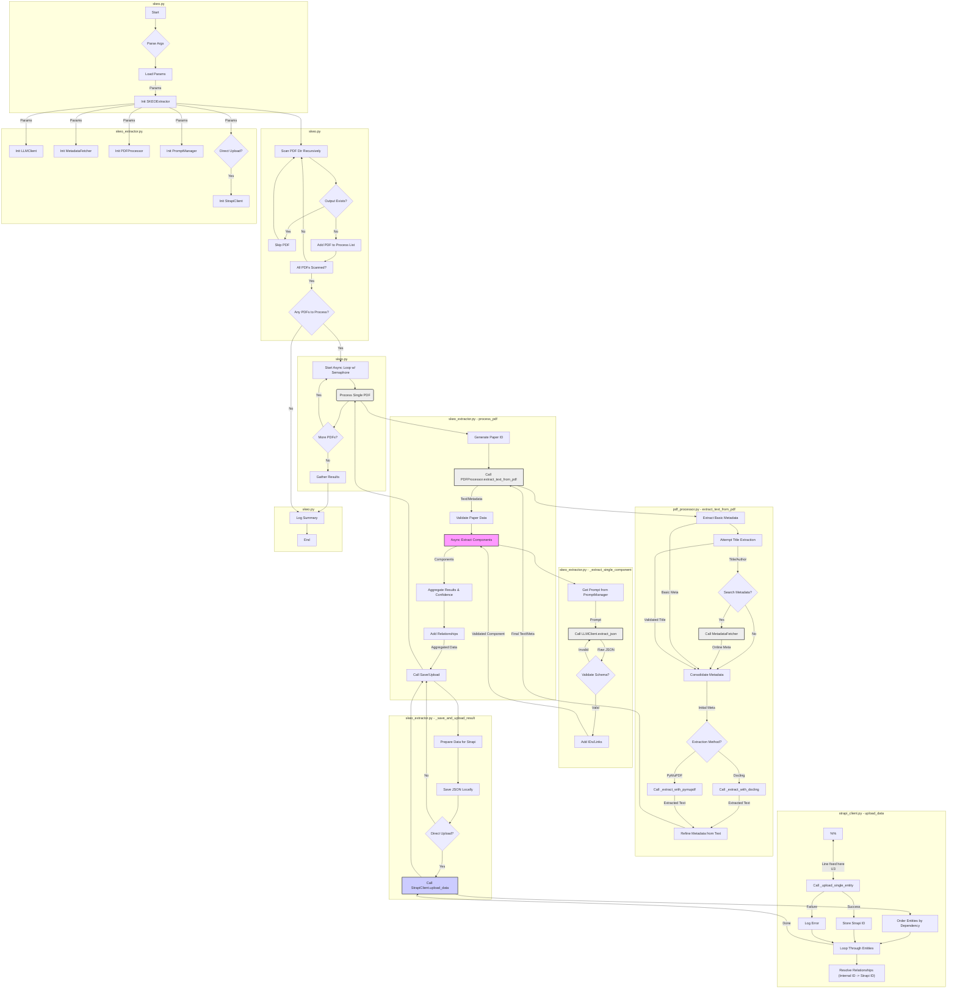

# SKEO - Scientific Knowledge Extraction Ontology Tool

SKEO is a comprehensive tool designed to extract structured knowledge from scientific papers according to the Scientific Knowledge Extraction Ontology. It processes PDF documents and extracts various components such as research problems, methodologies, challenges, and opportunities in a structured format that can be imported into a Strapi-based knowledge management system.

## Overview

SKEO leverages AI language models to extract structured knowledge from scientific papers, providing researchers with valuable insights into the scientific landscape. The tool follows the Scientific Knowledge Extraction Ontology (SKEO) framework to categorize and organize this knowledge.

Key components that SKEO extracts include:

- Research Context
- Theoretical Basis
- Research Problems
- Knowledge Gaps
- Research Questions
- Scientific and Methodological Challenges
- Methodological Frameworks
- Future Directions
- Potential Applications
- Limitations

## Program Flows

    
## Installation

### Requirements

Ensure you have Python 3.8+ installed.

### Option 1: Install using uv (recommended)

[uv](https://github.com/astral-sh/uv) is a fast, reliable Python package installer and resolver.

```bash
# Install uv if you haven't already
pip install uv

# Clone the repository
git clone https://github.com/yourusername/skeo.git
cd skeo

# Create and activate a virtual environment
uv venv
source .venv/bin/activate  # On Windows: .venv\Scripts\activate

# Install dependencies
uv pip install -r skeo-requirements.txt

# Download spaCy model
python -m spacy download en_core_web_md
```

Note: if you have pip related issues in downloading the spaCy model, ensure pip in correctly installed and is accessible. Run the following command
```bash
python -m ensurepip --upgrade
```

### Option 2: Install using pip

```bash
# Clone the repository
git clone https://github.com/yourusername/skeo.git
cd skeo

# Create and activate a virtual environment
python -m venv .venv
source .venv/bin/activate  # On Windows: .venv\Scripts\activate

# Install dependencies
pip install -r skeo-requirements.txt

# Download spaCy model
python -m spacy download en_core_web_md
```

### Dependencies

See the `skeo-requirements.txt` file for a complete list of dependencies. Main requirements include:

- aiohttp
- beautifulsoup4
- docling
- PyMuPDF
- langdetect
- pydantic
- python-dotenv
- PyYAML
- requests
- spacy
- tenacity

## Configuration

### Environment Variables

Copy the sample environment file and customize it with your API keys and settings:

```bash
cp sample.env .env
# Edit .env with your preferred text editor
```

Required environment variables include:

- `LLM_API_ENDPOINT`: API endpoint for the language model service
- `LLM_API_KEY`: API key for the language model service
- `LLM_MODEL_NAME`: Name of the language model to use
- `GOOGLE_SCHOLAR_API_KEY` (optional): API key for Google Scholar metadata lookup
- `GOOGLE_SCHOLAR_CX` (optional): Custom Search Engine ID for Google Scholar
- `STRAPI_URL`: URL of your Strapi instance (default: http://localhost:1337)
- `STRAPI_API_TOKEN`: API token for Strapi authentication

### Parameters

You can customize SKEO's behavior using a parameters YAML file. See the sample `skeo-params.yaml` for configuration options.

## Usage

### Basic Usage

```bash
python skeo.py --pdf-dir /path/to/pdfs --output-dir /path/to/output
```

### Command Line Options

```
usage: skeo.py [-h] --pdf-dir PDF_DIR [--prompt-file PROMPT_FILE] [--output-dir OUTPUT_DIR] [--params-file PARAMS_FILE] [--strapi-url STRAPI_URL] [--strapi-token STRAPI_TOKEN]

SKEO - Scientific Knowledge Extraction Ontology Tool

options:
  -h, --help            show this help message and exit
  --pdf-dir PDF_DIR, -d PDF_DIR
                        Directory containing PDF files to process
  --prompt-file PROMPT_FILE, -p PROMPT_FILE
                        YAML file containing extraction prompts (default: skeo_prompts.yaml)
  --output-dir OUTPUT_DIR, -o OUTPUT_DIR
                        Directory to save extraction output (default: skeo_output)
  --params-file PARAMS_FILE
                        YAML file containing parameters (default: use built-in defaults)
  --strapi-url STRAPI_URL, -s STRAPI_URL
                        Strapi API URL (default: from STRAPI_URL env var or http://localhost:1337)
  --strapi-token STRAPI_TOKEN, -t STRAPI_TOKEN
                        Strapi API token (default: from STRAPI_API_TOKEN env var)

Extracts structured knowledge from scientific papers according to the SKEO ontology
```

### Output Format

For each processed PDF, SKEO creates a JSON file containing the structured extraction results in a format compatible with the Strapi content management system. The output includes all extracted SKEO components with their relationships preserved.

## Advanced Configuration

### Customizing Extraction Prompts

You can customize the prompts used for each knowledge component by editing the `skeo_prompts.yaml` file.

### Parameters Configuration

The `skeo-params.yaml` file allows you to control various aspects of SKEO's behavior:

- LLM settings (model, temperature, tokens)
- PDF processing options
- Extraction components to include/exclude
- Parallel processing settings
- Direct upload to Strapi

## Strapi Integration

SKEO can directly upload extracted knowledge to a Strapi instance with the appropriate content models. Set `direct_upload: true` in your parameters file to enable this feature.

Before uploading, SKEO will test the connection and endpoints to ensure compatibility.

## Folder Structure

```
.
├── skeo.py                 # Main script
├── skeo_prompts.yaml       # Extraction prompts
├── skeo-params.yaml        # Configuration parameters
├── skeo-requirements.txt   # Dependencies
├── sample.env              # Sample environment variables
├── README.md               # This documentation
└── skeo_output/            # Default output directory
```

## Troubleshooting

### Common Issues

1. **LLM API Connection Errors**:
   - Check that your `LLM_API_ENDPOINT` and `LLM_API_KEY` are correct
   - Verify your network connection and any proxy settings

2. **PDF Processing Errors**:
   - Ensure PDFs are properly formatted and readable
   - Try the alternative extraction method by setting `extract_method: "pymupdf"` in parameters

3. **Strapi Upload Issues**:
   - Verify your Strapi URL and API token
   - Check that your Strapi instance has the required content types
   - Run with `test_endpoints: true` to validate connectivity

### Logs

Check the `skeo_extraction.log` file for detailed logs of the extraction process.

## License

Creative Commons

## Acknowledgements

SKEO is based on the Scientific Knowledge Extraction Ontology (SKEO) research developed by Tam Nguyen. SKEO leverages existing ontologies.
